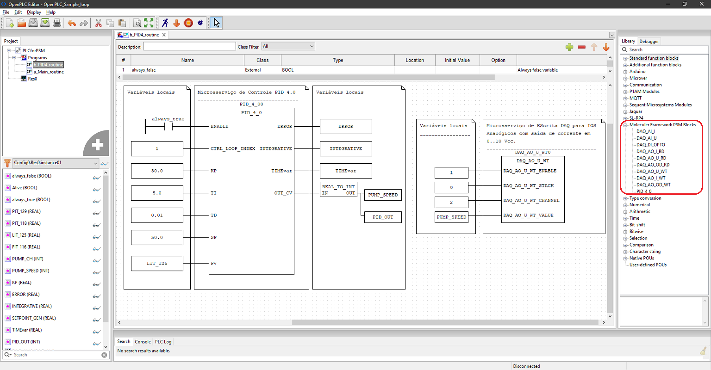
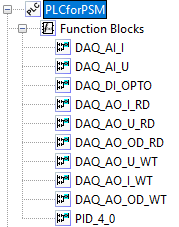

# Moleculer_Framework_PSM_Blocks

   

Moleculer_Framework_PSM_Blocks for OpenPLC.    
This is the library set of blocks which allows to create the following blocks on openPLC:  

The file PSM_code_r03, shall be paste inside the PSM coding area on openPLC runtime.  
Open this folder on OpenPLC editor to see the blocks, you may compile and re-generate the file Moleculer_Framework_PSM_Blocks.st, loading it on openPLC importing tool generate the library.   
Open PLC importing tool: https://autonomylogic.com/docs/3-3-adding-new-blocks-to-openplc-editors-library/     
Please carry on some tests and provide feedback to: eduardo.viana@unesp.br   
