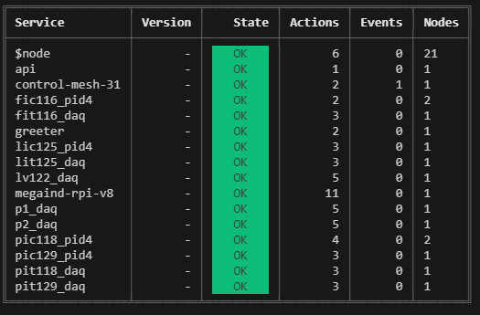
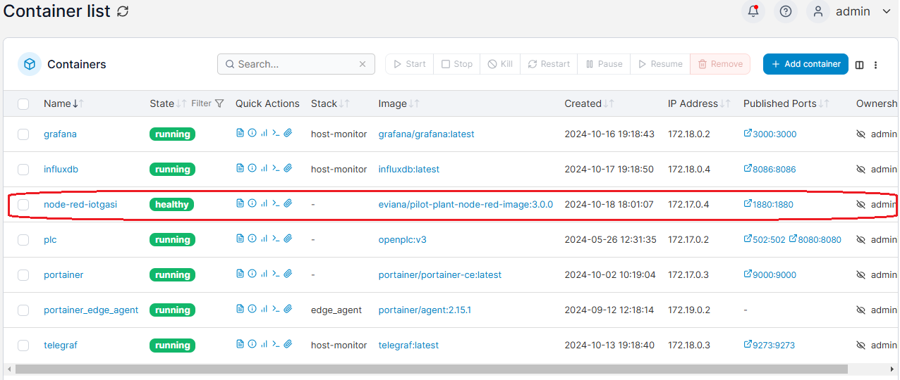

# Node-RED image restoration

Below are the services currently running on moleculer REPL, they are required to the proper function of the control loops.

 

## From Docker-Hub:

1 - Once Node-Red applications were containerized you can install from the public directory under the command:   
      > docker pull eviana/pilot-plant-node-red-image:latest   

2 - And run the container via Docker Hub at rasp prompt:   
      > docker run --name node-red-iotgasi -p 1880:1880 eviana/pilot-plant-node-red-image:latest   

 

## Notes:  
Any further configuration can be easily done thru Portainer at 192.168.1.108:9000 [admin/admin]
The image above contains all functionalities already working.  

Please test and provide feedback to: eduardo.viana@unesp.br

  
