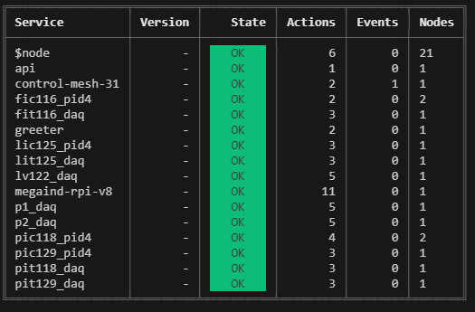

# Node-RED-for-Pilot-Plant-4.0 library  
<p align="center">
 
</p> 
Unesp Pilot Plant 4.0 Node-red files for process control library.   
The node-red-contrib-pilot-plant-control is the set of files necessary to implement the Pilot Plant 4.0 library for node-red.   
This activate the microsservices and request reading & control from/to Pilot Plant 4.0 variables.   

This is a set of microservice blocks named:      
- DAQ_AO_U_WT
- DAQ_AO_U_RD  
- DAQ_AI_U 
- DAQ_AO_i_WT   
- DAQ_AO_I_RD   
- DAQ_AI_I
- DAQ_AO_OD_WT  
- DAQ_AO_OD_RD   
- DAQ_DI_OPTO  
- PID 4.0.   

# node-red-contrib-pilot-plant-control 

Node Red client for Moleculer with suported lybraries developed for Pilot Plant 4.0 control.   

# Install Instructions

Below are the services currently running on moleculer REPL, they are required to the proper function of the control loops.
<p align="center">
 
</p>

### From Docker-Hub:

Once Node-Red applications were conteinerized you can install from the public directory under the command:
      docker pull eviana/pilot-plant-node-red-image:latest

And run the container via Docker Hub at rasp prompt:
      docker run --name node-red-iotgasi -p 1880:1880 eviana/pilot-plant-node-red-image:latest

Notes: 
Any further configuration can be eaily done thru Portainer at 192.168.1.108:9000 [admin/admin]
The image above contains all functionalities already working, anyhow if you need to install any additional blocks, please see below commands:

On ~/.node-red folder you must type:   
```npm install node-red-contrib-pilot-plant-control```   

and to activate transporter config if necessary!  
```npm install nats```   

Please test and provide feedback to: eduardo.viana@unesp.br  