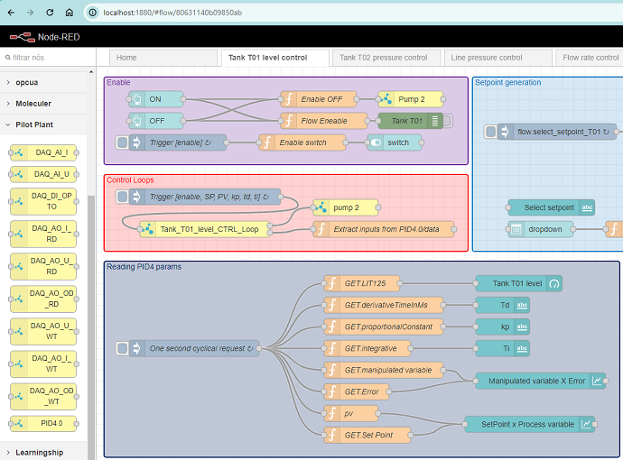

# Node-RED-for-Pilot-Plant-4.0 library   
Unesp Pilot Plant 4.0 Node-red files for process control library.   
The node-red-contrib-pilot-plant-control is the set of files necessary to implement the Pilot Plant 4.0 library for node-red.   
This activate the microsservices and request reading & control from/to Pilot Plant 4.0 variables.   

This is a set of microservice blocks named:      
DAQ_AO_U_WT,  
DAQ_AO_U_RD,   
DAQ_AI_U,   
DAQ_AO_i_WT,   
DAQ_AO_I_RD,   
DAQ_AI_I,   
DAQ_AO_OD_WT,   
DAQ_AO_OD_RD,   
DAQ_DI_OPTO  
PID 4.0.  

# node-red-contrib-pilot-plant-control   
Node Red client for Moleculer with suported lybraries developed for Pilot Plant 4.0 control.   

# Install Instructions



On ~/.node-red folder you must type:

```npm install node-red-contrib-pilot-plant-control```

and to activate transporter config if necessary!   

```npm install ioredis``` or ```npm install nats```   

Please test and provide feedback to: eduardo.viana@unesp.br   

