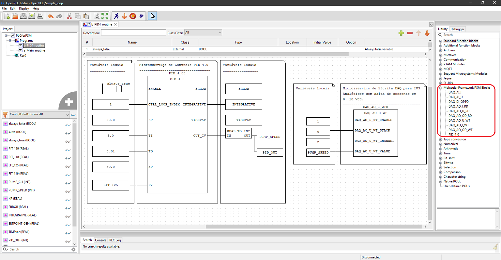

   <b>
   OpenPLC-Sample-loop
   </b>
   

OpenPLC Sample loop for Pilot Plant 4.0 (requires Moleculer Framework PSM blocks installed)   

Please carry on some tests and provide feedback to: eduardo.viana@unesp.br  
